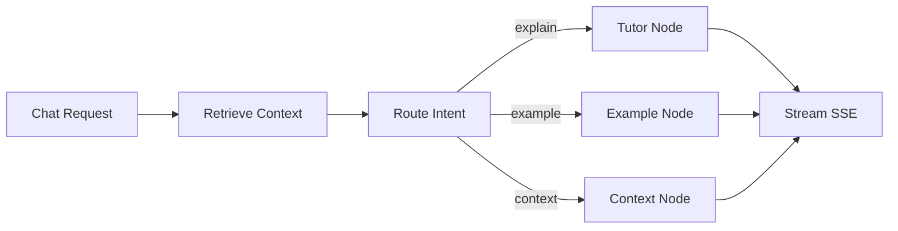

# Phase 2 MVP: Router + 3 Specialized Agents

## Problem

Phase 1 has a single Tutor path only. Chat requests are always handled by the same behavior, which limits usefulness when users need:

- concrete code-style examples (`example` intent)
- background prerequisite context (`context` intent)

Without intent routing, users must manually steer behavior, and outputs are inconsistent for different learning tasks.

## Scope

- In scope:
  - LangGraph-based intent routing for three intents: `explain`, `example`, `context`
  - Three agent nodes: Tutor, Example Generator, Context Enricher
  - Shared typed state and node contracts
  - SSE streaming compatibility with existing frontend
  - API behavior update for `POST /api/books/{book_id}/chat`
  - Tests for routing, node outputs, and stream integrity

- Out of scope:
  - Quiz Master and Study Planner implementation
  - Persistent progress/session tracking (SQLite expansion)
  - Major frontend redesign

## Goals

- Route each incoming chat request to the most appropriate agent behavior.
- Preserve current streaming UX (`token`, `sources`, `done`) with consistent payload schema.
- Keep Tutor as safe fallback path when routing confidence is low or routing fails.
- Maintain source citation metadata for all agent outputs.

## Non-goals

- Building a full multi-step workflow graph (e.g. explain then auto-quiz) in this MVP.
- Storing long-term agent state/checkpoints.
- Introducing new external infrastructure beyond current local-first setup.

## Proposed Design

### High-level flow

### Shared state contract

`AgentState` should minimally include:

- `query: str`
- `book_id: str`
- `chat_history: list[ChatMessage]`
- `retrieved_chunks: list[dict]`
- `agent_type: str` (`explain` | `example` | `context`)
- `response: str`
- `source_chunks: list[dict]`

### Router behavior

- Classify intent into one of: `explain`, `example`, `context`.
- If classification is ambiguous, default to `explain`.
- Routing decision must be deterministic enough for test coverage.

### Agent responsibilities

- Tutor (`explain`): concise conceptual explanation grounded in retrieved chunks.
- Example Generator (`example`): produce practical examples tied to retrieved material.
- Context Enricher (`context`): explain prerequisite/background concepts and connect back to user query.

### Streaming behavior

- Keep SSE event sequence:
  - `token` (zero-to-many)
  - `sources` (single)
  - `done` (single)
- Optional future-compatible event: `error` (single, terminal)

## API and Data Changes

### Endpoint behavior

- Existing endpoint remains: `POST /api/books/{book_id}/chat`
- Request model remains compatible with current `ChatRequest`.
- Response stays `text/event-stream`.

### Response metadata shape

`sources` payload remains a JSON list of chunks with:

- `chunk_id`
- `chapter`
- `section`
- `page_numbers`
- `score`

No storage schema migration is required for this Phase 2 MVP.

## Risks and Mitigations

- Risk: intent misclassification sends user to wrong behavior.
  - Mitigation: deterministic fallback to Tutor and simple keyword-assisted routing baseline before model-only routing.

- Risk: stream contract drift breaks frontend parser.
  - Mitigation: keep existing event names and add stream-frame tests.

- Risk: agent outputs become verbose/inconsistent.
  - Mitigation: strict per-agent prompts with output constraints and citations requirement.

- Risk: latency increases due to added routing step.
  - Mitigation: lightweight router prompt and shared retrieval done once before route-specific generation.

## Test Plan

- Unit tests:
  - router intent mapping for representative queries
  - fallback behavior when intent unknown
  - per-agent formatter/source payload shape

- Integration tests:
  - upload -> ready -> chat (`explain`) path
  - upload -> ready -> chat (`example`) path
  - upload -> ready -> chat (`context`) path

- Streaming tests:
  - SSE frames include valid `event:` and `data:` lines
  - terminal `done` event is always emitted
  - `sources` event is emitted once per request

- Manual checks:
  - frontend renders tokens incrementally
  - sources display without parse errors

## Rollout Plan

1. Introduce router and 3 nodes behind an internal feature flag (`PHASE2_ROUTING_ENABLED`).
2. Keep Tutor-only path as default fallback initially.
3. Enable Phase 2 routing in local/dev and validate tests/manual scenarios.
4. Remove feature flag once behavior is stable.

## Implementation Checklist

- [ ] Create LangGraph state and graph assembly module in `backend/app/agents/graph.py`.
- [ ] Add router node contract in `backend/app/agents/router.py` returning `agent_type`.
- [ ] Implement Tutor node adapter in `backend/app/agents/tutor.py` to conform to `AgentState` updates.
- [ ] Add Example Generator node in `backend/app/agents/example_gen.py` with citation-preserving output.
- [ ] Add Context Enricher node in `backend/app/agents/context_enricher.py` with prerequisite explanations.
- [ ] Ensure retrieval is executed once and passed via `retrieved_chunks` state.
- [ ] Keep SSE event contract stable in streaming bridge used by `backend/app/api/routes/chat.py`.
- [ ] Update `backend/app/api/routes/chat.py` to invoke graph entrypoint instead of Tutor-only path.
- [ ] Add config flag(s) in `backend/app/config.py` for Phase 2 routing toggle.
- [ ] Add/update tests for router intent mapping and fallback behavior.
- [ ] Add streaming contract integration tests (`token`, `sources`, `done` order/availability).
- [ ] Validate local non-Docker flow end-to-end on `127.0.0.1` frontend + backend.
- [ ] Update devlog/changelog after implementation is complete.
